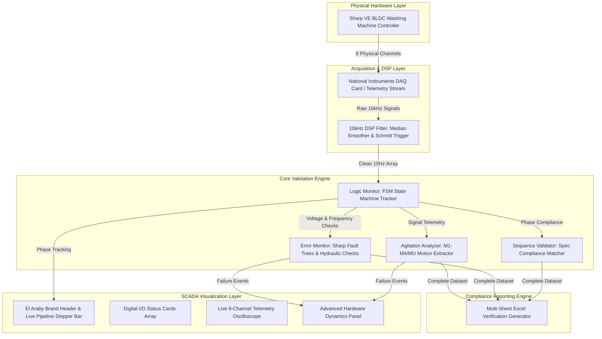
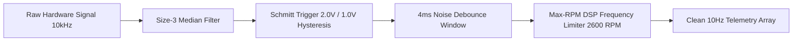
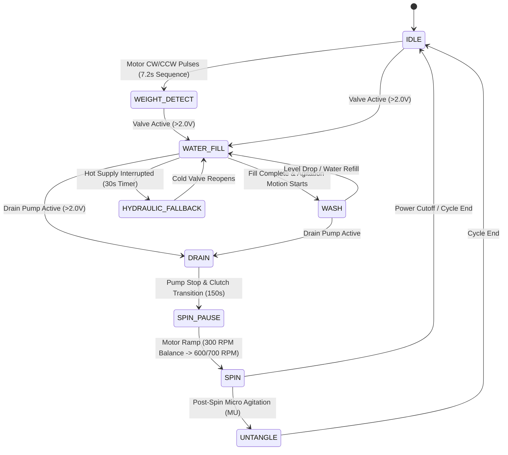

# SHARP VE-BLDC Industrial HIL Validation Suite


## Engineering Lead & Authorship

- **Lead R&D Systems Engineer**: Ziad Emad Allam
- **Organization**: El Araby Group R&D Engineering Division
- **System Domain**: Hardware-in-the-Loop (HIL) Automated Firmware Validation & SCADA Analytics
- **Target Platform**: Sharp VE-BLDC 11kg / 13kg Washing Machine Series

---

## Executive Summary

The **SHARP VE-BLDC Industrial HIL Validation Suite** is a high-fidelity Hardware-In-the-Loop (HIL) automated testing, signal acquisition, and firmware auditing platform.

Designed for real-time validation of embedded washer control units, the system samples 8 physical analog and frequency channels at 10,000 Hz. Through high-speed digital signal processing (DSP), Schmitt trigger thresholding, and state-machine inference, the suite automates physical software verification. It validates 100% of the embedded timing specifications, agitation motor waveforms (M1-M4, MU, MR), safety fault trees, and hydraulic fallback sequences defined by Sharp factory engineering standards.

---

## Master System Architecture

The software follows a modular **Clean Architecture** model, isolating hardware acquisition, digital signal processing (DSP), finite state machine (FSM) inference, rule-based error evaluation, and industrial SCADA visualization.



---

## Real-Time Signal Processing Pipeline (DSP)

Raw physical inputs pass through a multi-stage digital signal processing pipeline before being fed into the validation engines:



---

## Hardware IO Channel & Sensor Mapping Matrix

The system monitors 8 electrical and frequency signals via the NI-DAQ interface. Signal conversion rules and physical load mappings are defined below:

| Channel Name | Signal Type | Range / Voltage | Binary Threshold | Physical Load / Sensor Connection | Functional Validation Purpose |
| :--- | :--- | :--- | :--- | :--- | :--- |
| **Motor_RPM** | Frequency Pulse | 0 - 2600 RPM | DSP Frequency Filter | BLDC Motor Hall Sensor Feedback | Spin Speed Curve & Agitation Verification |
| **Cold_V** | Analog Voltage | 0 - 5.0 V | >2.0V ON / <1.0V OFF | Cold Water Inlet Solenoid Valve | Water Fill & Hydraulic Fallback Tracking |
| **Hot_V** | Analog Voltage | 0 - 5.0 V | >2.0V ON / <1.0V OFF | Hot Water Inlet Solenoid Valve | Hot Water Fill & Interruption Detection |
| **Softener** | Analog Voltage | 0 - 2.5 V | >2.0V ON / <1.0V OFF | Softener Dispenser Solenoid Valve | Fabric Softener Dispensing Stage |
| **GearMotor** | Analog Voltage | 0 - 5.0 V | >2.0V ON / <1.0V OFF | Gear Motor / Retractor Mechanism | Clutch Shifting between Wash & Spin |
| **Motor_V** | Analog Voltage | 0 - 5.0 V | >2.0V ON / <1.0V OFF | BLDC Inverter Power Relay | Motor Power ON/OFF Pulse & Stroke Timings |
| **Pump** | Analog Voltage | 0 - 5.0 V | >2.0V ON / <1.0V OFF | Drain Pump Power Relay | Drain Duration & Thermal Duty Monitoring |
| **Door** | Analog / Reserved | 0 - 5.0 V | >2.0V ON / <1.0V OFF | Safety Lid / Door Lock Switch | Lid Safety Interlock Verification |

---

## Finite State Machine (FSM) & Process Pipeline

The state machine infers washer operational phases using discrete voltage combinations and motor frequency signatures:



---

## Agitation Motor Motion Extraction Matrix (M1 - M4 & MU)

The **AgitationAnalyzer** extracts exact Clockwise (CW), Counter-Clockwise (CCW), and Stop durations in milliseconds for every wash program:

| Course Group | Program List | Motion | CW Pulse (s) | Stop Time (s) | CCW Pulse (s) | Stop Time (s) | Target Phase |
| :--- | :--- | :--- | :--- | :--- | :--- | :--- | :--- |
| **Group 1** | Regular, Quick, Baby Care, Quick Rinse | **M2** | 0.5s - 1.5s | 1.0s | 0.5s - 1.5s | 1.0s | Initial Wash (60s) |
| **Group 1** | Regular, Quick, Baby Care, Quick Rinse | **M3** | 0.7s - 2.1s | 1.0s - 1.5s | 0.7s - 2.1s | 1.0s - 1.5s | Mid Wash (180s) |
| **Group 1** | Regular, Quick, Baby Care, Quick Rinse | **M4** | 0.6s - 2.2s | 1.0s - 1.5s | 0.6s - 2.2s | 1.0s - 1.5s | Main Wash & Rinse |
| **Group 2** | Heavy, Cotton, Jeans | **M2 - M4** | 0.7s - 2.5s | 1.0s - 2.0s | 0.7s - 2.5s | 1.0s - 2.0s | Heavy Wash Cycles |
| **Group 3** | Delicates, Wool, Sports Wear | **M2 - M4** | 0.5s | 2.0s | 0.5s | 2.0s | Gentle Care Cycles |
| **Special** | Blanket | **M2 / M3** | 2.4s | 1.6s | 2.4s | 1.6s | Heavy Blanket Wash |
| **Special** | Blanket | **M4** | 3.8s | 0.7s | 3.8s | 0.7s | Untangle Motion |
| **Special** | Tub Clean | **M2 / M3** | 3.4s | 4.6s | 3.4s | 4.6s | Tub Soak Stirring |
| **Special** | Tub Clean | **M4** | 1.5s | 1.0s | 1.5s | 1.0s | Supply with Stirring |
| **All Courses** | Untangle Phase | **MU** | 0.3s | 0.5s - 0.7s | 0.3s | 0.5s - 0.7s | Post-Spin Unweaving |

---

## Industrial Fault Tree & Safety Library

The **ErrorMonitor** checks telemetry against Sharp industrial fault standards and hydraulic safety parameters:

| Fault Code | Failure Description | Trigger Condition & Tolerances | Priority | Severity |
| :--- | :--- | :--- | :--- | :--- |
| **E1** | Drain Timeout | Water level fails to reset within 15 minutes (900s) of pump activation. | HIGH | CRITICAL |
| **E2** | Lid Safety Fault | Lid opened during active washing motor stroke or high-speed spin. | HIGH | HIGH |
| **E3-2** | Unbalance Failure | Machine fails load redistribution after 3 consecutive spin pause/refill retries. | HIGH | HIGH |
| **E5** | Supply Timeout | Target water level frequency not reached within 20 minutes (1200s) of valve opening. | HIGH | HIGH |
| **E6-1** | Overflow Risk | Inlet valves and drain pump active simultaneously for >10 seconds. | CRITICAL | CRITICAL |
| **E7-1 / E7-3** | Motor Hall Failure | Hall-sensor feedback missing during active Wash (E7-1) or Spin (E7-3). | CRITICAL | CRITICAL |
| **E9** | Water Leakage | Unexpected water level frequency drop during active Wash phase. | HIGH | HIGH |
| **EA** | Abnormal Water | Water detected in tub during high-speed Spin phase. | CRITICAL | CRITICAL |
| **Eb-1** | Motor Relay Stuck | Unplanned motor rotation detected while state machine is IDLE. | CRITICAL | CRITICAL |
| **HE-FALLBACK-DELAY** | Hydraulic Delay Violation | Cold water valve reopening delayed by >30s during hot water supply fallback sequence. | HIGH | HIGH |
| **HE-HOT-CUTOFF** | Hot Valve Cutoff Defect | Hot water valve command shut off (0V) during fallback instead of staying active. | CRITICAL | CRITICAL |
| **PUMP-DUTY** | Thermal Duty Overload | Drain pump continuous operation exceeds 150s or violates 10s minimum cooldown. | MEDIUM | MEDIUM |

---

## Automated Reporting & Defect Audit Engine

Upon stopping test execution, the engine compiles a multi-sheet `.xlsx` compliance document:

1. **Raw Telemetry Sheet:**
   - 10Hz high-speed acquisition log formatted with timestamp columns (`H`, `Min`, `Sec`, `ms`) and raw channel telemetry.
2. **Automated Verification Sheet:**
   - Phase-by-phase compliance summary detailing expected vs actual durations, tolerance deltas, and PASS/FAIL evaluation.
3. **Raw Data Defect Report Sheet:**
   - Chronologically sorted bug report isolating all FAIL events with exact start/end row ranges (`Row X-Y`), severity level, and raw technical evidence.

---

## Installation & Hardware Setup

### Prerequisites
- Python 3.8+
- National Instruments DAQmx Driver (optional for physical DAQ hardware; simulation mode enabled by default)

### Environment Setup
```bash
pip install PyQt5 pyqtgraph pandas xlsxwriter nidaqmx qtawesome openpyxl
```

### Execution
```bash
python main.py
```

---

## Industrial Quality Compliance Statement

This validation platform was designed and implemented for rigorous embedded software auditing of Sharp BLDC washing machine controllers manufactured by El Araby Group. All timing rules, state machine transitions, and tolerance thresholds strictly match Sharp Engineering Specification Document `Sharp VE BLDC 11,13kg V0.xlsx`.
