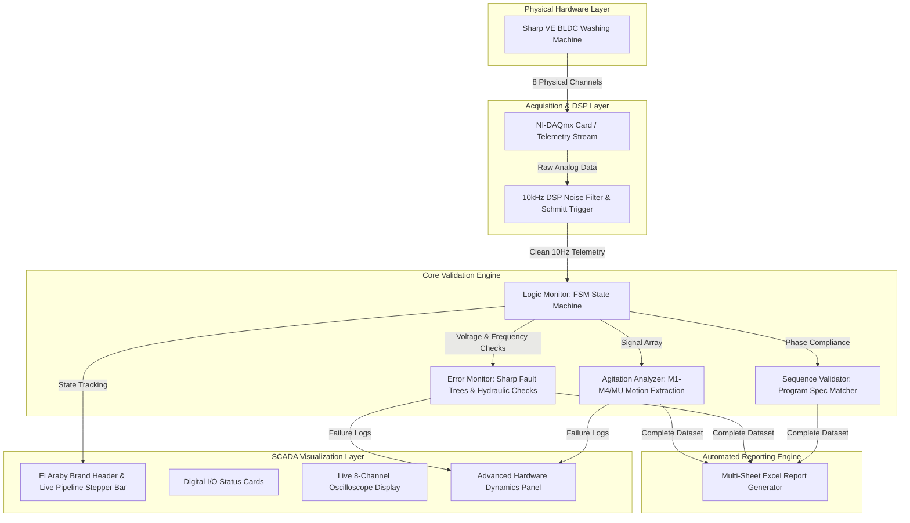
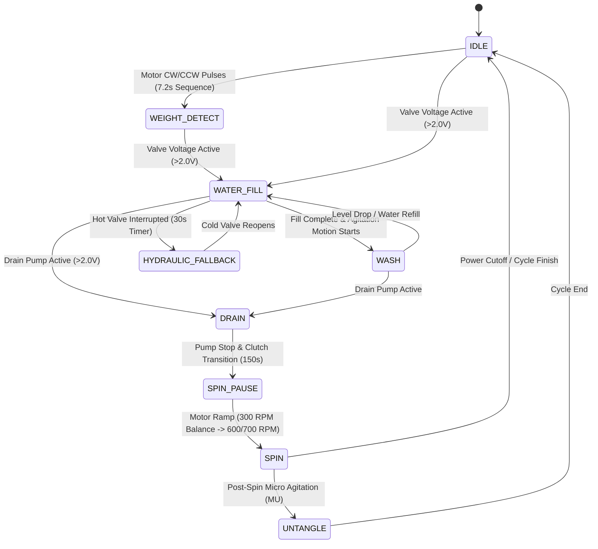

# SHARP VE-BLDC Industrial HIL Validation Suite


## Engineering Lead & Authorship

- **Lead R&D Systems Engineer**: Ziad Emad Allam
- **Organization**: El Araby Group R&D Engineering Division
- **System Domain**: Hardware-in-the-Loop (HIL) Automated Firmware Validation & SCADA Analytics

---

## Executive Summary

The **SHARP VE-BLDC Industrial HIL Validation Suite** is an advanced Hardware-In-the-Loop (HIL) automated testing and diagnostic platform engineered specifically for the **Sharp VE BLDC 11kg/13kg** washing machine firmware series.

By sampling 8 high-speed electrical and frequency channels through a National Instruments DAQ hardware interface at 10,000 Hz with real-time DSP noise filtering, the system automates physical software verification. It validates 100% of the embedded timing specifications, agitation motor waveforms (M1-M4, MU, MR), safety protocols, and hydraulic fallback sequences defined by Sharp engineering standards.

---

## System Architecture

The software architecture is designed using modular **Clean Architecture** principles, decoupling hardware signal acquisition, digital signal processing (DSP), finite state machine (FSM) phase inference, rule-based error evaluation, and industrial SCADA visualization.



---

## Finite State Machine (FSM) & Hydraulic Logic

The core logic engine infers physical washer operations from analog voltage levels and motor frequency pulses. It supports 12 factory programs across 4 water levels:



---

## Industrial Fault Tree & Safety Library

The **ErrorMonitor** continuously checks telemetry against Sharp industrial fault specifications and hydraulic failure rules:

| Fault Code | Failure Description | Trigger Logic & Tolerances | Severity |
| :--- | :--- | :--- | :--- |
| **E1** | Drain Timeout | Tub water level fails to reset within 15 minutes of continuous pump operation. | CRITICAL |
| **E2** | Lid Safety Violation | Lid opened during active washing motor stroke or high-speed spin phase. | HIGH |
| **E3-2** | Unbalance Failure | Machine fails load redistribution after 3 consecutive spin pause/refill retries. | HIGH |
| **E5** | Water Fill Timeout | Target water level frequency not reached within 20 minutes of inlet valve opening. | HIGH |
| **E6-1** | Overflow Risk | Inlet valves and drain pump remain active simultaneously for >10 seconds. | CRITICAL |
| **E7-1 / E7-3** | Motor Hall Failure | Hall-sensor feedback missing during active Wash (E7-1) or Spin (E7-3). | CRITICAL |
| **E9** | Water Leakage | Unexpected water level frequency drop detected during active Wash phase. | HIGH |
| **EA** | Abnormal Water Level | Water detected in tub during high-speed Spin phase. | CRITICAL |
| **Eb-1** | Motor Relay Fused | Unplanned motor rotation detected while state machine is IDLE. | CRITICAL |
| **HE-FALLBACK-DELAY** | Hydraulic Delay Violation | Cold water valve reopening delayed by >30s during hot water supply fallback sequence. | HIGH |
| **HE-HOT-CUTOFF** | Hot Valve Cutoff Defect | Hot water valve command shut off (0V) during fallback instead of staying active. | CRITICAL |
| **PUMP-DUTY** | Thermal Duty Overload | Drain pump continuous operation exceeds 150s or violates 10s minimum cooldown. | MEDIUM |

---

## Key Technical Features

1. **Agitation Motion Extraction (M1, M2, M3, M4, MU, MR):**
   - Automatically measures Clockwise (CW), Counter-Clockwise (CCW), and Stop durations in milliseconds for Group 1, Group 2, Group 3, Blanket, and Tub Clean programs.

2. **Process Pipeline Stepper Bar:**
   - Real-time industrial SCADA stepper bar with active glowing neon indicators, completed phase checkmarks (`✓`), and dynamic iteration badges (`RINSE #1`, `DRAIN #2`).

3. **Multi-Sheet Executive Excel Reporting:**
   - **Raw Telemetry**: High-resolution 10Hz data log with timestamp breakdown (H, Min, Sec, ms).
   - **Automated Verification**: Phase-by-phase compliance summary with expected vs actual durations.
   - **Raw Data Defect Report**: Priority-sorted bug log with exact start/end row ranges (`Row X-Y`) and evidence logs.

---

## Installation & Execution

### Prerequisites
- Python 3.8+
- National Instruments DAQmx Driver (optional for live hardware DAQ, simulated mode supported natively)

### Setup Command
```bash
pip install PyQt5 pyqtgraph pandas xlsxwriter nidaqmx qtawesome openpyxl
```

### Running the Suite
```bash
python main.py
```

---

## Industrial Compliance & Verification

This platform is deployed for validation of embedded firmware logic in Sharp washing machine controllers manufactured by El Araby Group. All timing tolerances conform strictly to Sharp Factory Standard Specification `Sharp VE BLDC 11,13kg V0.xlsx`.
